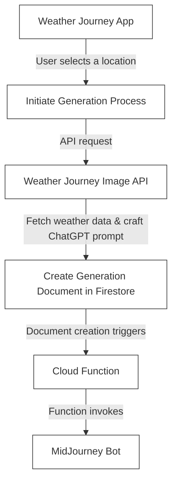

<p align="center">
  <a href="http://nestjs.com/" target="blank"></a>
</p>

[circleci-image]: https://img.shields.io/circleci/build/github/nestjs/nest/master?token=abc123def456
[circleci-url]: https://circleci.com/gh/nestjs/nest

  <p align="center">A progressive <a href="http://nodejs.org" target="_blank">Node.js</a> framework for building efficient and scalable server-side applications.</p>
    <p align="center">
<a href="https://www.npmjs.com/~nestjscore" target="_blank"></a>
<a href="https://www.npmjs.com/~nestjscore" target="_blank"></a>
<a href="https://www.npmjs.com/~nestjscore" target="_blank"></a>
<a href="https://circleci.com/gh/nestjs/nest" target="_blank"></a>
<a href="https://coveralls.io/github/nestjs/nest?branch=master" target="_blank"></a>
<a href="https://discord.gg/G7Qnnhy" target="_blank"></a>
<a href="https://opencollective.com/nest#backer" target="_blank"></a>
<a href="https://opencollective.com/nest#sponsor" target="_blank"></a>
  <a href="https://paypal.me/kamilmysliwiec" target="_blank"></a>
    <a href="https://opencollective.com/nest#sponsor"  target="_blank"></a>
  <a href="https://twitter.com/nestframework" target="_blank"></a>
</p>
  <!--[](https://opencollective.com/nest#backer)
  [](https://opencollective.com/nest#sponsor)-->

## Description

This function managed the generations and location of the weather Journey Mobile App. The API can fetch the weather data from a location and generate a MidJourney Prompt with chatGPT

## How it works




## Installation

```bash
$ npm install
```

## Running the app

```bash

export NODE_ENV=development  

# development
$ npm run start

# watch mode
$ npm run start:dev

# production mode
$ npm run start:prod
```

## Test

```bash
# unit tests
$ npm run test

# e2e tests
$ npm run test:e2e

# test coverage
$ npm run test:cov
```

## Deploy to GCP

```bash
# build
docker build -t europe-west1-docker.pkg.dev/weatherapp-journey/weather-generation-api/generation-api:0.0.1 --platform linux/amd64 .

# push
docker push europe-west1-docker.pkg.dev/weatherapp-journey/weather-generation-api/generation-api:0.0.1

# deploy
gcloud run deploy weather-generation-api \
    --image europe-west1-docker.pkg.dev/weatherapp-journey/weather-generation-api/generation-api:0.0.1 \
    --platform managed \
    --region europe-west1 \
    --allow-unauthenticated \
    --min-instances 1 \
    --max-instances 2 \
    --memory 512Mi \
    --cpu 1 \
    --port 3000 \
    --set-env-vars "OPENAI_API_KEY=" \
    --service-account=weather-generation-api-runner@weatherapp-journey.iam.gserviceaccount.com
```

## License

Nest is [MIT licensed](LICENSE).
